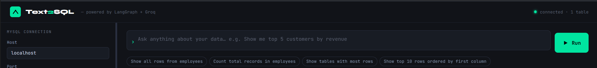
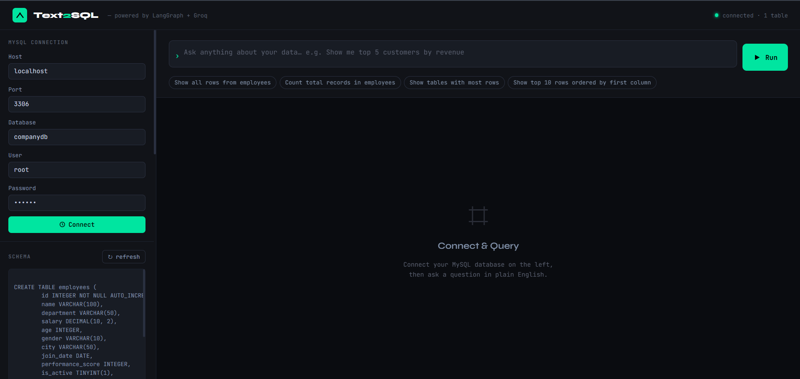
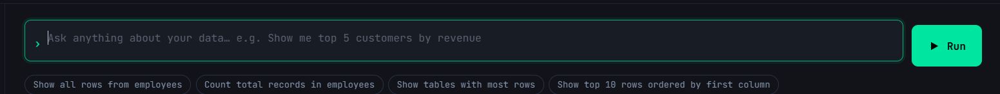
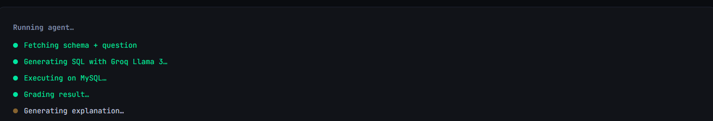
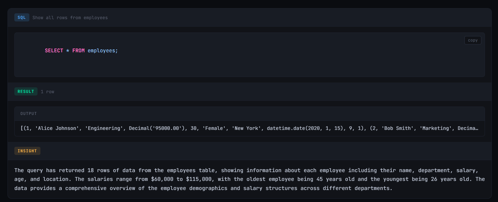
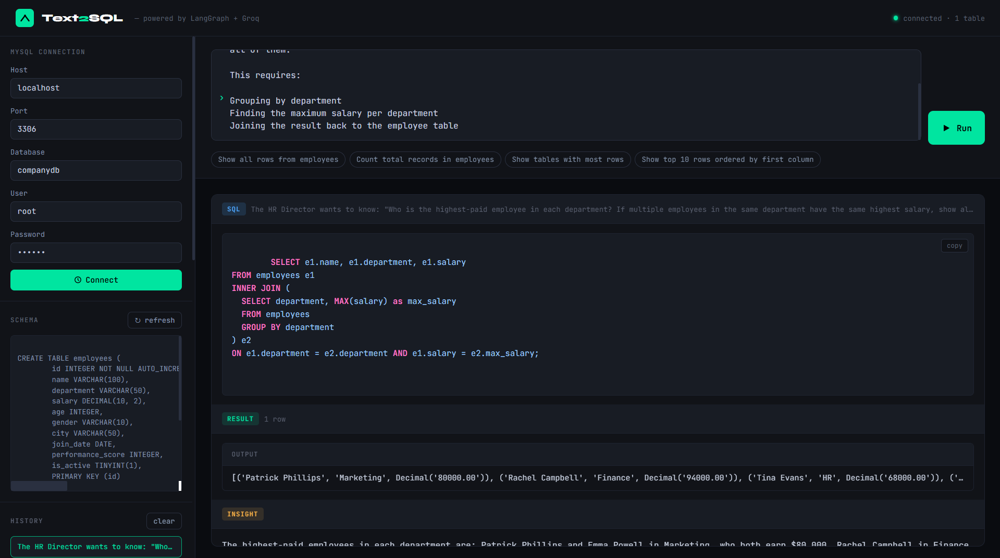

# 🗄️ Text-to-SQL Agent
**LangChain + LangGraph + Groq (Llama 3) + MySQL**


---

## 📸 Screenshots

> **Upload your screenshots here after running the project!**


### 🔌 Database Connection
<!-- After connecting to MySQL, take a screenshot of the sidebar showing "connected" status -->
<!-- Save your image as: screenshots/01-connection.png -->



---

### 🏠 Home Screen / UI Overview
<!-- Screenshot of the full app UI after connecting -->
<!-- Save your image as: screenshots/02-home.png -->



---

### ✍️ Asking a Question
<!-- Screenshot of you typing a question in the input bar -->
<!-- Save your image as: screenshots/03-query-input.png -->



---

### ⚙️ Agent Running (Loading Steps)
<!-- Screenshot of the animated loading card showing the agent steps -->
<!-- Save your image as: screenshots/04-agent-running.png -->



---

### 📊 Query Result — Table View
<!-- Screenshot of a result showing the SQL + data table + insight -->
<!-- Save your image as: screenshots/05-result-table.png -->



---

### 📜 Large Query
<!-- Screenshot of the history panel on the left sidebar with past queries -->
<!-- Save your image as: screenshots/07-history.png -->



---

## 📁 How to Add Your Screenshots

1. Create a `screenshots/` folder inside your project root:
   ```bash
   mkdir screenshots
   ```

2. Take screenshots while using the app (use **Snipping Tool** on Windows, **Cmd+Shift+4** on Mac)

3. Save each screenshot with the exact filename shown above:
   ```
   text2sql-agent/
   ├── screenshots/
   │   ├── 01-connection.png
   │   ├── 02-home.png
   │   ├── 03-query-input.png
   │   ├── 04-agent-running.png
   │   ├── 05-result-table.png
   │   ├── 06-self-correction.png    ← optional
   │   └── 07-history.png
   ├── backend/
   └── frontend/
   ```

4. The images will automatically show up in this README when viewed on GitHub or locally.

---

## 🏗️ Architecture

```
User Question (natural language)
        │
        ▼
┌─────────────────────────────────────────────────────┐
│                  LangGraph Agent                    │
│                                                     │
│  [1] generate_sql  ←─── LangChain (Groq + Prompt)  │
│         │                                           │
│         ▼                                           │
│  [2] execute_sql   ←─── SQLAlchemy → MySQL          │
│         │                                           │
│         ▼                                           │
│  [3] grade_result  ── ok? ──► [5] explain ──► END   │
│         │                                           │
│         └── error? ──► [4] fix_sql ──► execute_sql  │
│                            (max 3 retries)          │
└─────────────────────────────────────────────────────┘
        │
        ▼
  FastAPI → HTML/CSS/JS Frontend
```

| Component | Role |
|-----------|------|
| **LangChain** | Prompt templates, LLM chains (generate SQL, fix SQL, explain), SQLDatabase wrapper, output parsers |
| **LangGraph** | Stateful graph, conditional edges (retry loop), state management across nodes |
| **Groq (Llama 3)** | Free, fast LLM inference |
| **FastAPI** | REST API connecting frontend ↔ agent |
| **MySQL** | Your database |

---

## 🚀 Quick Start

### 1. Get a free Groq API key

👉 https://console.groq.com → sign up → Create API Key (free tier is generous)

### 2. Set up the backend

```bash
cd backend

# Create and activate virtual environment
python -m venv venv
source venv/bin/activate        # Windows: venv\Scripts\activate

# Install dependencies
pip install -r requirements.txt

# Set your API key
cp .env.example .env
# Edit .env and paste your GROQ_API_KEY
```

### 3. Start the backend

```bash
# Make sure you're in /backend with venv active
uvicorn main:app --reload --port 8000
```

You should see:
```
INFO:     Uvicorn running on http://127.0.0.1:8000
```

### 4. Open the frontend

Open `frontend/index.html` directly in your browser — no web server needed.

### 5. Connect and query

1. Fill in your MySQL host, port, database, user, and password in the sidebar
2. Click **Connect**
3. Type your question and press **Enter** or click **Run**

---

## 💬 Example Questions

```
Show me the top 10 customers by total order value
How many orders were placed last month?
What is the average product price by category?
List all users who have never placed an order
Which products are out of stock?
Show monthly revenue for the past year
```

---

## 📂 Project Structure

```
text2sql-agent/
├── screenshots/             ← add your screenshots here
│   ├── 01-connection.png
│   ├── 02-home.png
│   └── ...
├── backend/
│   ├── main.py              # FastAPI app (routes)
│   ├── agent.py             # LangGraph agent (core logic)
│   ├── db.py                # MySQL helpers
│   ├── requirements.txt
│   └── .env.example
└── frontend/
    └── index.html           # Full UI (HTML + CSS + JS)
```

---

## 🔄 How the LangGraph Loop Works

```
generate_sql  →  execute_sql  →  grade_result
                                      │
                              ┌───────┼───────┐
                             ok      fix    max_retries
                              │       │       │
                           explain  fix_sql  explain
                              │       │
                             END   execute_sql (loop)
```

- **`generate_sql`** — LangChain chain: passes schema + question to Groq Llama 3, returns clean SQL
- **`execute_sql`** — Runs the SQL on MySQL via LangChain's `SQLDatabase`
- **`grade_result`** — Conditional edge: if no error → explain; if error and retries < 3 → fix
- **`fix_sql`** — LangChain correction chain: sends the failed SQL + error back to the LLM for a fix
- **`explain`** — LangChain chain: produces a plain English summary of the results

---

## 🛠️ Troubleshooting

| Problem | Solution |
|---------|----------|
| `GROQ_API_KEY not set` | Add your key to `backend/.env` |
| `Connection refused` | Make sure `uvicorn main:app --reload` is running |
| `Access denied for user` | Check MySQL credentials; grant permissions |
| `CORS error` | Backend must run on port 8000; if different, update `API` constant in `index.html` |
| `Module not found` | Run `pip install -r requirements.txt` in the venv |

---

## ⚙️ Customising

- **Change model** — In `agent.py`, replace `llama3-70b-8192` with `llama3-8b-8192` (faster) or `mixtral-8x7b-32768`
- **Change max retries** — Pass `max_retries` in the initial state (default: 3)
- **Row limit** — Table renders max 200 rows; change `rows.slice(0, 200)` in `index.html`
- **Different DB** — Change `mysql+pymysql://` to `postgresql+psycopg2://` or `sqlite:///`

---

## 📄 License

MIT — free to use, modify, and share.
